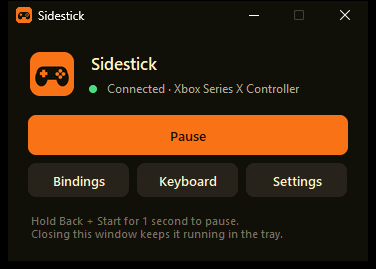
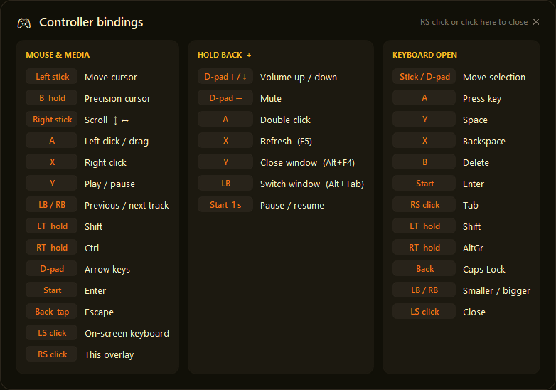
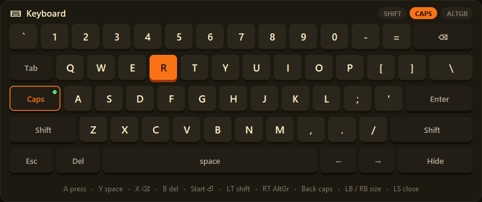
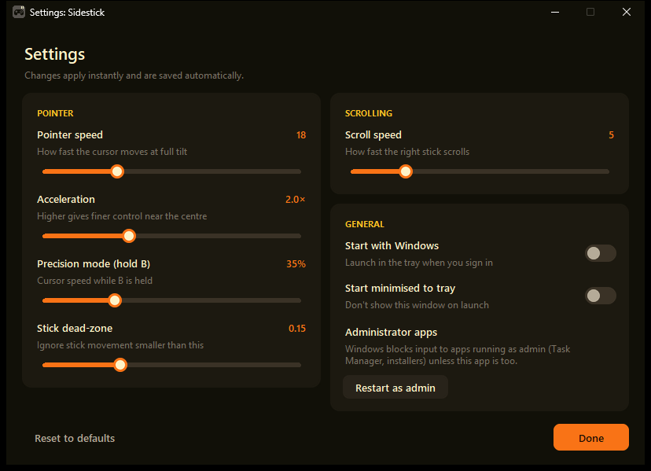

# Sidestick

Use an Xbox controller as a mouse and keyboard on Windows. Browse, watch videos, control media and type from the couch, no desk required.



- **Mouse:** analog cursor with an acceleration curve, precision mode, click and drag, scrolling in both directions
- **Keyboard:** an on-screen keyboard you drive with the stick. It never steals focus from the app you're typing into.
- **Shortcuts:** media keys, volume, Alt+Tab, Alt+F4, F5, Escape, arrow keys
- **Pause:** hold Back + Start for a second so games can have the controller to themselves
- **Stays out of the way:** lives in the system tray, remembers your settings, can start with Windows

## Download and run (no Python needed)

1. Download **`Sidestick-windows.zip`** from the [Releases](../../releases) page.
2. Unzip it anywhere (e.g. `Documents\Sidestick`).
3. Run **`Sidestick.exe`**.

> **"Windows protected your PC"?** The app isn't code-signed, so SmartScreen warns about it. Click **More info → Run anyway**. Some antivirus tools also flag unsigned apps that simulate keyboard/mouse input. If yours does, you can check the source here and [build it yourself](#building-the-exe).

Plug in the controller (USB or Bluetooth), before or after starting. The status line shows when it connects.

## Button bindings

Press **RS (right stick click)** at any time to show these bindings on screen.



### Everyday: mouse and media

| Button | Action |
|---|---|
| Left stick | Move cursor (with acceleration) |
| **B** (hold) | Precision mode: slow cursor for small targets |
| Right stick | Scroll (up/down and left/right) |
| **A** | Left click. Hold to drag |
| **X** | Right click |
| **Y** | Play / pause |
| **LB / RB** | Previous / next track |
| **LT** (hold) | Shift |
| **RT** (hold) | Ctrl |
| D-pad | Arrow keys (repeat while held) |
| **Start** | Enter |
| **Back** (tap) | Escape |
| **LS** (click) | Open the on-screen keyboard |
| **RS** (click) | Show / hide the bindings overlay |

### Hold Back + …

| Button | Action |
|---|---|
| D-pad ↑ / ↓ | Volume up / down (repeats while held) |
| D-pad ← | Mute |
| **A** | Double click |
| **X** | Refresh (F5) |
| **Y** | Close window (Alt+F4) |
| **LB** | Switch windows (Alt+Tab). Keep holding Back and press LB again to move through windows. Release Back to switch. |
| **Start** (hold 1 s) | Pause / resume the controller (it rumbles to confirm) |

Tapping Back sends Escape only if you release it quickly and didn't use it for a shortcut.

### While the on-screen keyboard is open



| Button | Action |
|---|---|
| Left stick / D-pad | Move the selection (repeats while held) |
| **A** | Press the selected key |
| **Y** | Space |
| **X** | Backspace |
| **B** | Delete |
| **Start** | Enter |
| **RS** (click) | Tab |
| **LT** (hold) | Shift |
| **RT** (hold) | AltGr |
| **Back** | Caps Lock |
| **LB / RB** | Make the keyboard smaller / bigger |
| **LS** (click) | Close the keyboard |

The keyboard also has on-screen Shift (applies to the next key), Caps, Esc, Del and arrow keys. You can click the keys with the mouse too. Keys go to whichever app had focus, because the keyboard never takes focus itself.

### Pausing for games

Most games read the controller directly, so Sidestick would also move your mouse while you play. **Hold Back, then hold Start for 1 second** to pause (the controller rumbles and the tray icon greys out). Do the same to resume. You can also pause from the main window or the tray menu.

## Settings

Open **Settings** from the main window or the tray icon. Changes apply instantly and are saved automatically to `%APPDATA%\Sidestick\settings.json`.



| Setting | What it does |
|---|---|
| Pointer speed | Cursor speed at full stick tilt |
| Acceleration | 1.0 = linear. Higher values give finer control near the centre and speed at the edges |
| Precision mode | Cursor speed while **B** is held |
| Stick dead-zone | Ignores small stick drift |
| Scroll speed | How fast the right stick scrolls |
| Start with Windows | Launches minimised to the tray when you sign in |
| Start minimised to tray | Don't show the main window on launch |
| Restart as admin | See below |

**Closing the main window keeps the app running in the tray.** To quit, right-click the tray icon and choose **Quit**.

### Apps running as administrator

Windows doesn't let normal apps send input to apps running as administrator (Task Manager, installers, some games' launchers). If the controller stops working in one of those, use **Settings → Restart as admin**.

## Requirements

- Windows 10 or 11
- An Xbox Series X|S or Xbox One controller (other XInput/SDL-compatible gamepads usually work too)
- Python 3.9+ only if running from source

## Running from source

```bat
git clone https://github.com/a7med3othman/sidestick.git
cd sidestick
run.bat
```

`run.bat` creates a private virtual environment (`.venv`) on first run, installs the dependencies, and starts the app without a console window.

To run it manually instead:

```bash
python -m pip install -r requirements.txt
python -m sidestick
```

Options: `--minimized` starts hidden in the tray. `--version` prints the version.

## Building the exe

```bat
build.bat
```

This sets up `.venv-build`, runs the tests, and uses PyInstaller to produce:

- `dist\Sidestick\Sidestick.exe`: the app folder
- `dist\Sidestick-windows.zip`: the same folder, zipped for sharing

Releases are automated: pushing a tag such as `v2.0.0` makes GitHub Actions build the zip and attach it to a new Release.

## Troubleshooting

| Problem | Fix |
|---|---|
| Status says *Waiting for a controller* | Reconnect the controller, or try a USB cable. It's detected automatically within a couple of seconds. |
| Cursor moves while playing a game | Pause with **Back + Start** (hold 1 s). |
| Nothing happens in Task Manager or an installer | Use **Settings → Restart as admin**. |
| Cursor drifts on its own | Raise **Stick dead-zone** in Settings. |
| "Sidestick is already running" | It's in the system tray. Click the ^ arrow on the taskbar to find it. |
| Something went wrong | Check the log at `%APPDATA%\Sidestick\log.txt`. |

## Project layout

```
Sidestick.pyw               Double-click launcher / PyInstaller entry point
sidestick/
  mapper.py                 All controller → keyboard/mouse logic (pure, unit-tested)
  layout.py                 On-screen keyboard layout and navigation
  engine.py                 Controller polling thread (pygame) that drives the mapper
  output.py                 Keyboard/mouse output (pynput)
  config.py                 Constants, button map, saved settings
  win32.py                  Windows helpers (no-focus windows, startup, admin, DPI)
  icon.py                   App icon, drawn in code
  app.py                    Wires the engine, windows and tray together
  ui/                       Theme, widgets, main/settings windows, overlay, keyboard, tray
tests/                      pytest suite (no controller needed)
```

Run the tests with `python -m pytest`.

## License

[MIT](LICENSE)
